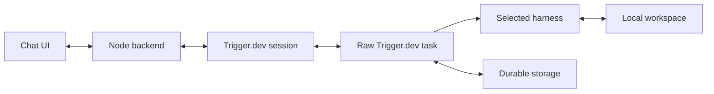

# Multi-harness POC

A **shared coding workspace with a chat UI**, where you choose **Claude Code, Codex, or Pi for each turn**. Trigger.dev manages the conversation and execution; each harness supplies its own agent loop, tools, and native history. The starter uses a raw Trigger.dev task and sessions.

For example: ask Claude to understand some code, switch to Codex to edit it, then ask Pi to review the changes.

The frontend is plain HTML, CSS, and JavaScript, backed by a Node server. You do not need the Trigger.dev monorepo or a local platform stack.

[How it works](#how-it-works) · [Features](#features) · [Run locally](#run-it-locally) · [Explore your code](#explore-your-own-code) · [Code tour](#find-your-way-around-the-code) · [Deploy](#storage-and-deployment) · [Troubleshooting](#checks-and-troubleshooting)

## How it works



When you send a message:

1. **The backend accepts the request.** Each request has a stable ID. The backend sends your prompt and harness choice through the Trigger.dev session. Each conversation processes one turn at a time.
2. **The task prepares the workspace.** A new conversation starts from the sample files or code you imported. A fresh worker restores an existing conversation's latest saved files and native histories.
3. **The selected harness runs.** It can inspect, search, create, and edit files. Text and tool activity stream back to the browser. These are ordinary local filesystem operations.
4. **The turn is saved.** Changed files and native history are uploaded, then a commit record stores the answer and references to those files. The conversation advances to that record only after storage succeeds.
5. **The task waits for another message.** Trigger.dev can checkpoint it while waiting. If the execution eventually ends, a later message can start a fresh run and restore the same conversation.

**Switching harnesses preserves two kinds of context.** Each harness keeps its own native session. Separately, completed prompts and answers provide shared context between harnesses. Codex receives what Claude accomplished, and returning to Claude resumes Claude's own session with the intervening updates.

**Files persist across worker restarts.** Local development can use a shared storage directory. Deployed workers use an S3-compatible object store. With the optional JuiceFS integration, workspace contents and native-session files go through JuiceFS; the tested setup uses Redis for metadata and S3 for file blocks. Answers and commit manifests remain in the application's object store. The frontend's SQLite database holds conversation ownership and its transcript cache.

**The initial upload runs in the background during the first turn.** The worker freezes a separate copy of the starting files, then lets the harness work on the local workspace. Output streams while uploading continues; marking the turn saved waits for durability. Subsequent saves upload changed contents.

## Features

- **Per-turn harness selection**, with native session resumption and shared context across Claude Code, Codex, and Pi.
- **Your own code as a workspace**, using the repository importer.
- **File creation and editing** shared across harnesses.
- **Streaming answers and tool activity** in a minimal frontend.
- **Stop with rollback**, including during the initial background upload.
- **Automatic retries and worker recovery** from saved state.
- **Duplicate-request handling**, delivery retries, and reconnection after browser reload.
- **Persistent conversations**, paginated transcripts, and retrievable older context.
- **Local development and deployed workers**, with optional JuiceFS storage.
- **Setup checks, automated tests, and cloud storage benchmarks.**

Harness selection is manual, and edits affect the conversation's workspace copy. Shell commands are disabled. Git commits and PR creation, conversation branching, and per-tool approval UI would need additional implementation. The frontend uses browser-cookie ownership; hosting it for multiple users requires proper authentication.

## Run it locally

### 1. Install the prerequisites

- **Node.js 24+**. `.nvmrc` pins the tested version; run `nvm install && nvm use` if you use nvm.
- **pnpm 10.33.2**, available through `corepack enable`.
- **Git and ripgrep** on your PATH. On macOS: `brew install git ripgrep`. On Debian/Ubuntu: `sudo apt-get install git ripgrep`.
- A Trigger.dev project with the Sessions API available.
- An Anthropic API key for Claude Code and Pi, and/or an OpenAI API key for Codex. Model calls use your provider account.

Clone or download this repository, open its directory, then run:

```sh
corepack pnpm install --frozen-lockfile
corepack pnpm run setup
```

`setup` creates `.env` without overwriting an existing file. These instructions use `pnpm` below; `corepack pnpm` works too.

### 2. Configure your project

Edit `.env`:

| Variable              | Where it comes from                                              |
| --------------------- | ---------------------------------------------------------------- |
| `TRIGGER_PROJECT_REF` | Your Trigger.dev project settings (`proj_…`).                    |
| `TRIGGER_SECRET_KEY`  | That project's **Development** secret key for local worker runs. |
| `ANTHROPIC_API_KEY`   | Your Anthropic API key; enables Claude Code and Pi.              |
| `CODEX_API_KEY`       | Your OpenAI API key; enables Codex.                              |
| `CODEX_MODEL`         | A Codex-compatible model available to your OpenAI project.       |

You can start with one provider. Select a harness whose credentials you configured. `CLAUDE_MODEL` and `PI_MODEL` default to `claude-haiku-4-5` and can be changed in `.env`.

Check the setup and log in to Trigger.dev:

```sh
pnpm run doctor
pnpm run login
```

`doctor` checks local prerequisites and whether settings are present. It does not validate API keys. The CLI commands use a dedicated `multi-harness-poc` profile so they do not depend on your default CLI profile.

### 3. Start the worker and frontend

Terminal 1:

```sh
pnpm run worker
```

Wait for the CLI to report that the local worker is ready. It connects to Trigger.dev Cloud; you do not need Docker or a local Trigger.dev server.

Terminal 2:

```sh
pnpm run dev
```

Open **http://127.0.0.1:3000**. Both terminals must stay running. Set `PORT` in `.env` if port 3000 is in use.

### 4. Try a conversation

The included workspace is a small sample project named **Release Notes Demo**, whose mascot is an **otter**.

1. Select **Claude Code** and ask: `Read README.md and src/releases.ts. What does this project do?`
2. Select **Codex** and ask: `What did the previous harness find? Read src/releases.ts and describe how release notes are formatted.`
3. Select **Pi** and ask: `Summarize the project name, mascot, and release-note format from this conversation.`
4. Switch back to **Claude Code** and ask a follow-up. Activity should show that it resumed its native history.

Use whichever harnesses you configured. The answer should identify Release Notes Demo, the otter, and Markdown release notes. Check the answer's contents as well as its completion status.

**Stop** cancels the active turn and restores the previous committed native state. Failed harness calls retry up to three times from that same state. Worker failures also retry; an in-flight request is saved before execution so a fresh worker can recover it. **Retry delivery** resends an unconfirmed request with its original ID. **Edit and retry** creates a new attempt after a failed or stopped turn. Reloading the page preserves pending delivery and reconnects the transcript.

## Explore your own code

Prepare a small repository or a focused subdirectory:

```sh
pnpm run workspace /absolute/path/to/your-repo/src
```

This creates a source-file map in [`src/workspace-files.json`](src/workspace-files.json). In a Git checkout it uses tracked files, including their current edits. In a non-Git folder it scans supported source-file extensions. Hidden files, dependency/build folders, credential filenames, lockfiles, and symlinks are excluded.

Review the generated file. Its contents are copied into the worker's workspace, sent to the selected model as needed, and saved in your configured object storage. Use a curated folder when you need to choose exactly what is included. There is no file-count or workspace-size cutoff in the importer. Start with the part of your project you want to work on; larger workspaces take longer to bundle and snapshot. Large file reads and directory listings are paginated.

Start a **new conversation** after preparing different code. Existing conversations retain their saved workspace. The local worker rebuilds when the source map changes; a deployed worker needs another `pnpm run deploy`.

Try prompts such as:

- `List the entry points and explain how a request reaches the main logic.`
- `Find the validation code and explain what it rejects.`
- `Continue the previous harness's review. Read the relevant files and check its conclusions.`

The harnesses can read, create, and edit files in the conversation's workspace copy. Successful turns save those changes alongside native history, so the next harness sees them. Failed attempts and stopped turns restore the previous committed workspace before retrying or continuing. Your original repository is not modified.

Try: `Add a release-note example to README.md`, then switch harnesses and ask: `Read the example just added and improve it.` Claude uses Write/Edit; Codex and Pi expose workspace-scoped write/edit tools. Shell commands stay disabled, and `.conversation/` is reserved for saved history.

## Find your way around the code

Read these files in order:

| File                                                           | What to look for                                                                                  |
| -------------------------------------------------------------- | ------------------------------------------------------------------------------------------------- |
| [`src/protocol.ts`](src/protocol.ts)                           | Request IDs, harness selection, terminal results, and the portable handoff prompt.                |
| [`src/trigger/multi-harness.ts`](src/trigger/multi-harness.ts) | The task loop: wait for input, deduplicate requests, call a harness, save state, stream a result. |
| [`src/harnesses/`](src/harnesses/)                             | One adapter per SDK. Each adapter implements the `Harness` function type.                         |
| [`src/native-state.ts`](src/native-state.ts)                   | Content-addressed workspace and native files; verified restoration and rollback.                  |
| [`src/juicefs.ts`](src/juicefs.ts)                             | Batch upload and restore through the stock JuiceFS client, without FUSE.                          |
| [`src/storage.ts`](src/storage.ts)                             | Local filesystem and S3-compatible object stores.                                                 |
| [`src/history.ts`](src/history.ts)                             | Immutable turn commits and retrievable cross-harness context.                                     |
| [`src/server.ts`](src/server.ts)                               | Local HTTP routes, conversation ownership, SQLite admission, and the SSE proxy.                   |
| [`src/watch-output.ts`](src/watch-output.ts)                   | Reopen published-SDK output reads after idle EOF, preserving the cursor.                          |
| [`public/app.js`](public/app.js)                               | Harness picker, streaming, Stop, local outbox, and conversation navigation.                       |
| [`public/state.js`](public/state.js)                           | Merge server results with browser state without losing unconfirmed requests.                      |

Each turn saves changed files as content-addressed objects, then saves an immutable commit containing the complete answer, native session handles, and a link to the previous turn. Only the commit reference and an in-flight request reference go into session metadata. Updating that reference commits the turn; partially uploaded state is never used as a completed result.

The harnesses edit regular files on the worker. Object storage is not mounted as a filesystem: after a successful turn, the app hashes each file, uploads changed contents, and saves a manifest of file paths and object references. Unchanged files reuse their existing objects.

A fresh worker restores the committed files before resuming a native session. A checkpoint continuation restores the running process. Both paths retain the same conversation. The backend reconciles saved results even if the browser missed the stream, and the frontend loads earlier messages in pages.

The handoff prompt includes recent unseen turns within a context budget. Full completed turns remain available in `.conversation/`, with an index for retrieval. A large answer is stored intact and read in pages when needed. Each harness also retains its native context management; Pi's automatic compaction is explicitly enabled.

To add a harness, extend the enum in `protocol.ts`, implement an adapter, register it in the task, and add its frontend control and event rendering. Start with the existing adapters and keep the shared request/result protocol.

## Storage and deployment

Local development stores durable objects under `STORAGE_DIR`. `pnpm run setup` writes an absolute path into `.env` so the frontend and local worker use the same directory. Keep that directory when restarting the app. If you already have an older `.env`, add `STORAGE_DIR` with an absolute path before starting this version. `DATA_DIR` holds the frontend's SQLite database, including conversation ownership and its transcript cache.

For a deployed worker, configure an S3-compatible bucket, such as S3 or R2:

```dotenv
STORAGE_BUCKET=your-bucket
STORAGE_PREFIX=multi-harness
AWS_REGION=us-east-1
# Set this for R2 or another S3-compatible service:
STORAGE_ENDPOINT=
```

Give the application `GetObject` and `PutObject` access to its bucket prefix. Configure bucket-scoped credentials through the AWS credential chain locally and in the Trigger.dev environment variables for the deployed worker. The frontend needs access to the same bucket and prefix. **AWS credentials are never uploaded by this project's deployment hook.** For R2, use its S3 endpoint and region `auto`; for services that require path-style URLs, set `STORAGE_FORCE_PATH_STYLE=true`.

Objects are retained so conversations can resume and old turns remain readable. Do not apply an expiration policy to active objects. Use separate prefixes for independent installations, and keep both the object store and frontend database in your backup plan.

A deployed worker refuses to start without `STORAGE_BUCKET`, because its local filesystem does not survive a fresh worker. Once storage and provider credentials are configured:

```sh
pnpm run deploy
```

The build syncs the provider keys present in your `.env` as **secret environment variables** and syncs the configured model names. It also syncs non-secret storage settings, bundles the prepared source map and installs Git, ripgrep, and a checksum-verified JuiceFS client in the worker image.

After deployment, stop the local frontend, change `TRIGGER_SECRET_KEY` to the project's **Production** key, set `DATA_DIR=.data/production`, and run `pnpm run dev` again. Keep the Development and Production frontend databases separate. You do not need `pnpm run worker` when using the deployed worker.

The frontend remains local. Before hosting it for other people, replace the browser-cookie ownership mechanism with your authentication system and enforce access to each conversation. Provider and Trigger secret keys stay on the backend/worker, never in browser JavaScript.

### Use JuiceFS for workspace persistence

Set `JUICEFS_META_URL` to enable JuiceFS. Harnesses still edit ordinary files in a local workspace. At each successful turn, the worker hashes the files and uses `juicefs sync --files-from` to upload changed contents. A fresh run downloads the files listed in the saved manifest, verifies their hashes, and restores their paths and permissions before starting a harness. No FUSE device, privileged container, or Trigger.dev platform change is needed.

There are three storage components:

| Data                                                    | Location                                                           |
| ------------------------------------------------------- | ------------------------------------------------------------------ |
| Workspace contents and native session files             | JuiceFS, backed by its metadata database and object-storage blocks |
| Answers, pending requests, and immutable turn manifests | The application's `STORAGE_BUCKET` (or local `STORAGE_DIR`)        |
| Browser ownership and transcript cache                  | The frontend's SQLite database under `DATA_DIR`                    |

For a new conversation, the worker creates the workspace from the bundled source files locally and freezes a separate copy. Its initial upload runs alongside the first harness turn, so model output can stream while the upload is running. The turn is marked saved only after both the initial files and the turn's changes are durable. First-turn retries and Stop restore the frozen local copy, even while its upload is still running. If the upload fails, the pending request remains recoverable and no completed turn is recorded.

Each saved turn retains its own file references. A stopped or failed turn restores those references; it cannot overwrite an earlier turn's workspace. Files with unchanged contents are reused. Renames and deletions change the manifest. Switching an existing conversation to JuiceFS copies its files on its next successful save; earlier turns continue to use their original storage.

Install the local client if you run a development worker or the storage tests:

```sh
pnpm run juicefs:install
pnpm run test:juicefs
```

The installer verifies the release checksum and checks that the client starts. On Apple Silicon it tries the Intel release through Rosetta if the ARM client cannot start. The deployed build installs the Linux client independently.

For remote workers, prepare a dedicated metadata database and an object-storage bucket or prefix, then format a JuiceFS volume once. Follow the [JuiceFS metadata setup](https://juicefs.com/docs/community/databases_for_metadata/) and [object-storage setup](https://juicefs.com/docs/community/how_to_setup_object_storage/) for your provider. Use a database reachable from the workers; a SQLite database on a worker's local disk will not survive a fresh run. Redis needs persistence and `noeviction`; back up the metadata as well as the stored blocks.

For example, with Redis TLS and S3, set these variables in your shell using your own credentials, then run:

```sh
# JUICEFS_FORMAT_URL: rediss://your-redis-host:6380/0
# REDIS_PASSWORD: the dedicated Redis password
# ACCESS_KEY and SECRET_KEY: credentials scoped to the JuiceFS bucket
# JUICEFS_BUCKET_URL: https://your-bucket.s3.us-east-1.amazonaws.com
./juicefs-bin/juicefs format --storage s3 \
  --bucket "$JUICEFS_BUCKET_URL" "$JUICEFS_FORMAT_URL" multi-harness
```

For a private Redis CA, append `?tls-ca-cert-file=/absolute/path/ca.pem` to the format URL. JuiceFS places blocks under its volume name (`multi-harness/` in this example). The bucket can also hold the application's objects: use a different `STORAGE_PREFIX`, such as `app`, to keep them separate. Its credentials must support JuiceFS block reads, writes, deletes, and bucket listing.

Configure the application in `.env`:

```dotenv
JUICEFS_META_URL=rediss://:YOUR_URL_ENCODED_PASSWORD@your-redis-host:6380/0
JUICEFS_PREFIX=multi-harness
# Optional private CA: a quoted PEM with escaped newlines.
JUICEFS_CA_CERT="-----BEGIN CERTIFICATE-----\n...\n-----END CERTIFICATE-----\n"
```

Keep the S3 application-store settings from the deployment section above. Deploying syncs `JUICEFS_META_URL` as a secret and syncs the prefix and optional CA. Set bucket-scoped AWS credentials separately in the Trigger.dev environment. The volume's object-storage credentials are configured when formatting JuiceFS; the application store uses its own AWS credential chain. The frontend normally reads manifests and answers from S3 and does not run JuiceFS.

The connection is opened only for each sync operation. No mount or background client must survive a checkpoint. Contents edited during a turn become durable when that turn commits; an interrupted, uncommitted attempt is restored and retried from the previous saved turn.

Keep the JuiceFS volume, prefix, metadata, and application objects for as long as conversations reference them. Older manifests may still point to files that the current workspace deleted. A single Redis host with persistent disk supports this experiment, but it remains a single point of failure; use a backed-up, highly available metadata service for a hosted deployment.

### Use another Trigger.dev endpoint

Set `TRIGGER_API_URL` in `.env` and log the same CLI profile into that endpoint:

```sh
pnpm run login --api-url https://your-trigger-endpoint.example
```

Use project credentials from that endpoint. The normal default is `https://api.trigger.dev`.

## Checks and troubleshooting

```sh
pnpm run check
```

Type checking and tests run without model credentials or cloud calls. They cover forty long answers, snapshots larger than 4 MiB, fresh-store recovery, corrupt-object rejection, workspace write boundaries and rollback, and the frontend outbox. Tests use real local HTTP, filesystem, and MCP services. `pnpm run test:juicefs` additionally runs the real JuiceFS client with temporary SQLite metadata and local blocks, covering immutable versions, deletion, executable permissions, and corrupt-content rejection. To verify model access, use the conversation above while both terminals are running.

| Symptom                                          | Check                                                                                                                                           |
| ------------------------------------------------ | ----------------------------------------------------------------------------------------------------------------------------------------------- |
| `node:sqlite` is unavailable                     | Run Node 24+ in both terminals.                                                                                                                 |
| Runs fail after another checkout starts a worker | Run one development worker per project/environment; stop the old worker before starting this one.                                               |
| The worker cannot find the project               | Check `TRIGGER_PROJECT_REF`, your CLI profile, and the API endpoint.                                                                            |
| The browser stays pending                        | Keep the worker terminal open and use a Development key for local execution. Check the run in the Trigger dashboard.                            |
| A harness fails immediately                      | Check its provider key and model access in the worker terminal or run logs. Select a configured harness.                                        |
| Codex cannot inspect files                       | This adapter uses its `list_files` and `read_file` MCP tools; use the returned cursor to read subsequent pages. Its built-in shell is disabled. |
| A saved conversation shows older code            | Create a new conversation after importing a workspace.                                                                                          |
| An uncertain request survives reload             | Use **Retry delivery**; it deliberately retains the original ID.                                                                                |
| Port 3000 is occupied                            | Set another `PORT` and restart `pnpm run dev`.                                                                                                  |

### Continuing an older lab conversation

Older versions saved their transcript and a compressed snapshot in Trigger.dev itself. Those conversations remain readable. After the old run has finished, migrate a conversation into the configured object store:

```sh
pnpm run migrate harness-YOUR-SESSION-ID
```

The migration preserves every saved answer and the latest native workspace, then changes the session's storage reference. Start the updated worker to continue.

`HARNESS_TIMEOUT_MS` controls the per-attempt execution timeout (15 minutes by default). `AGENT_IDLE_TIMEOUT` controls how long an idle run waits before exiting; a later message can start a new run for the same conversation. These are execution settings, not conversation or answer-length limits.
